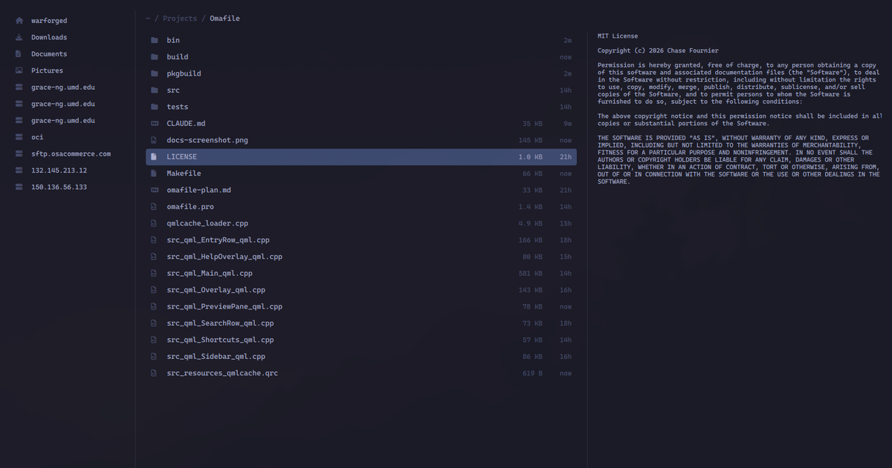

# OmaFile

**Simple, Fast, and Productive File Manager**

A dead-simple file manager for Omarchy



## Why

Nautilus has never really fit with Omarchy, but other Tui file manager like Yazi lack creature comforts like drag and drop. Omafile was built to be a middle ground, quick and themed, but keeps needed functionality at your fingertips.

## Install

```bash
./bin/install
```

Then make it the default for folders, so every other application opens them here:

```bash
xdg-mime default omafile.desktop inode/directory
```

That covers everything that asks the desktop to open a folder — a browser's "show in
folder", a file dropped on a terminal, `xdg-open .`.

### On Omarchy, that is only half of it

Omarchy's file-manager key does **not** go through the desktop's default. It runs Nautilus
by name, so setting the MIME handler changes what other applications do and leaves
`Super+Shift+F` opening Nautilus as before. The key has to be repointed separately.

**Omarchy 3.x** — edit `~/.config/hypr/bindings.conf`:

```
bindd = SUPER SHIFT, F, File manager, exec, uwsm-app -- omafile
bindd = SUPER ALT SHIFT, F, File manager (cwd), exec, uwsm-app -- omafile "$(omarchy-cmd-terminal-cwd)"
```

**Omarchy 4 (Quattro)** — bindings moved to Lua; edit `~/.config/hypr/bindings.lua`:

```lua
hl.unbind("SUPER + SHIFT + F")
o.bind("SUPER + SHIFT + F", "File manager", { launch = "omafile" })
```

Quattro also ships `/usr/share/applications/mimeapps.list` pointing `inode/directory` at
Nautilus. That is a system default and `xdg-mime` writes `~/.config/mimeapps.list`, which
takes precedence, so the command above works.

Either way, `hyprctl reload && hyprctl configerrors` afterwards

### "Reveal in File Explorer" and others in different apps

Often they don't go through the MIME default either. VS Code, Chromium and most GTK and
Electron applications make a **D-Bus** call to `org.freedesktop.FileManager1`, and whoever
owns that name answers — on a machine with Nautilus installed, that is Nautilus,
regardless of what `xdg-mime` says.

omafile can answer it. Copy the service file it ships:

```bash
mkdir -p ~/.local/share/dbus-1/services
cp /usr/share/omafile/org.freedesktop.FileManager1.service ~/.local/share/dbus-1/services/
```

`~/.local/share` takes precedence over `/usr/share`, so this wins without touching
Nautilus's copy — and `rm` on that one file puts everything back. Test it with:

```bash
gdbus call --session --dest org.freedesktop.FileManager1 \
  --object-path /org/freedesktop/FileManager1 \
  --method org.freedesktop.FileManager1.ShowItems '["file:///etc/hostname"]' ''
```

omafile should open `/etc` with `hostname` selected.

D-Bus starts `omafile --dbus-service` on demand; it owns the name, turns each call into an
ordinary omafile window, and exits again after 30 seconds idle. It is not a daemon and it
is never started by an ordinary launch, so nothing here is on the startup path.

### Plain Hyprland

`Super+F` is fullscreen on Omarchy, so pick another key there. On a stock Hyprland it is
free:

```
bind = SUPER, F, exec, omafile
windowrule = float on, match:class ^(omafile)$
windowrule = size 1200 800, match:class ^(omafile)$
windowrule = center on, match:class ^(omafile)$
```

Window-rule syntax changes between Hyprland releases; the above is what 0.56 accepts —
check the wiki if yours refuses it.

## Use

```
omafile [path]              open a directory (default: $PWD)
omafile --select <file>     open its parent, with it selected
omafile --properties <file> the same, with the properties panel open
omafile --sidebar        start with the sidebar open   (--no-sidebar to force it closed)
omafile --preview        start with the preview open   (--no-preview likewise)
```

Without a flag it reopens the way you left it.

## Keys

Bare letters filter. That is the whole idea: the fastest path from "window open" to "file
selected" is to start typing its name. Everything else is modified or an arrow key.

| Key | Action |
|---|---|
| *any letter* | Filter this directory, fuzzily |
| `↑` `↓` · `Ctrl+K` `Ctrl+J` | Move |
| `←` `Backspace` | Parent directory (Backspace edits the filter first) |
| `→` `Enter` | Open |
| `Shift+Enter` | Open in a new window |
| `Ctrl+Enter` | Open with… |
| `Escape` | Clear filter → clear selection → close |
| `Home` `End` · `PgUp` `PgDn` | Jump |
| `Ctrl+F` | Find recursively from here |
| `Ctrl+Alt+F` | Search inside files |
| `Ctrl+L` | Edit the path |
| `Ctrl+B` | Sidebar |
| `Ctrl+P` | Preview pane |
| `Ctrl+H` | Hidden files |
| `Super+C` `Super+X` `Super+V` | Copy / cut / paste |
| `Ctrl+C` `Ctrl+X` `Ctrl+V` | The same, for muscle memory |
| `Ctrl+Shift+C` | Copy absolute path |
| `Space` | Add to selection (`Shift+↑↓` or `Shift+click` for a range) |
| `Ctrl+A` | Select all |
| `F2` `Ctrl+R` | Rename in place |
| `Ctrl+Shift+R` | Bulk rename in `$EDITOR` |
| `Delete` | Move to trash |
| `Shift+Delete` | Delete permanently |
| `Ctrl+Z` | Undo |
| `Ctrl+Shift+N` | New folder |
| `Ctrl+T` | Terminal here |
| `Ctrl+N` | New window |
| `Ctrl+I` | Properties — mode, owner, exact size, and chmod |
| `Ctrl+D` | Pin this folder to the sidebar |
| `Ctrl+S` | Connect to… |
| `Ctrl+E` | Eject / unmount |
| `Ctrl+1` `Ctrl+2` `Ctrl+3` | Sort by name / size / time (again to reverse) |
| `F5` | Refresh |
| `Ctrl+?` | This table, in the app |

That table is generated from the same list that binds the keys, so it cannot drift.

## Mouse

If you like using your mouse frequently:

**Right-click** a file, the empty space below the list, the space beside the breadcrumb, or
a place in the sidebar. Entries that do not apply are greyed out rather than hidden, so the
menu never moves under you. Most entries are the same verbs the keys above run; a few —
"New file", and the ones that open a config — exist only here, because they have no
natural key. A sidebar entry offers the file that governs it: `~/.ssh/config` for a host,
`rclone config` for a remote, `config.toml` for anything else.

Clicking away closes the menu **and** does whatever that click would have done — a stray
right-click costs nothing.

**Pin** anything you keep coming back to. `Ctrl+D` pins the folder you are in; right-click
a row and choose *Pin to sidebar* for anything else, including a single file — that is the
only way to pin a file, since `Ctrl+D` can only ever mean the current directory. Pinned
folders open in place; a pinned file opens in whatever application owns it, the same as
pressing Enter on it. Right-click a pin to remove it. They live one path per line in
`~/.config/omafile/bookmarks`.

**Drag** a file onto a folder to move it there, out to another application, or in from one.
Hold over a folder for a moment and it opens, so you can drag into a tree you cannot see;
hold over a **breadcrumb** and it goes back up, which is how you get out again — or drop
straight onto a crumb to send something several levels up without letting go. `Ctrl`
forces a copy, `Shift` forces a move; otherwise it moves within a filesystem and copies[text](vscode-webview://1f8c171pbu3586vocku102ci4a4d1qpp45md216m2no225a8s04u/index.html?id%3D73989dae-e13d-45e1-aefe-29d642dd5947%26parentId%3D2%26origin%3Dcf0afaad-c448-4169-8c9b-1c5af6b91014%26swVersion%3D6%26extensionId%3DAnthropic.claude-code%26platform%3Delectron%26vscode-resource-base-authority%3Dvscode-resource.vscode-cdn.net%26parentOrigin%3Dvscode-file%3A%2F%2Fvscode-app%26session%3D3274e05f-37dc-4ce9-b473-7e88dd7cf541)
across one.

## Remote

SSH hosts come from `~/.ssh/config` — omafile keeps no host list of its own, so keys,
agents, `ProxyJump` and tunnels all work because `ssh` already makes them work. Add a
host there and it appears in the sidebar:

```
Host box
    HostName box.example.com
    User chase
    IdentityFile ~/.ssh/id_ed25519
```

`Ctrl+S` also takes `ssh://`, `sftp://`, `smb://`, `davs://`, `mtp://`,
`rclone:remote:path`, or a bare host name. SMB, WebDAV and MTP go through `gio`, so
authentication is the desktop's own dialog and omafile never stores a credential. Cloud
storage comes from `rclone listremotes`; omafile does not configure rclone — that is what
`rclone config` is for.

Once mounted, a remote is an ordinary path: browsing, drag and drop, rename, copy and
preview all work unchanged. Searching a host omafile mounted runs on the far end, so it
takes about as long as a local search rather than about as long as a walk over the wire.

## Bulk rename

`Ctrl+Shift+R` writes the selected names to a file, opens `$EDITOR`, and applies the diff
when you exit. Regex rename, sequential numbering, case changes and sorting come free,
with no UI at all. If the line count changed, nothing is renamed. Swaps and rotations are
ordered so no file is ever overwritten.

## Compressing

Right-click a selection and choose **Compress…**, then a format: zip, tar+gzip, tar+zstd,
tar+xz or 7z. The archive lands beside what it was made from, named after it — one item
gives `photos.zip`, several give the folder's own name — and a second archive of the same
thing becomes `photos (2).zip` rather than overwriting the first.

**Nothing is deleted.** An archive is a copy; the originals are exactly where you left
them. `Ctrl+Z` removes the archive again.

**Extract** unpacks an archive — zip, tar and its compressed variants, 7z, rar, iso —
into a folder named after it, beside it. Always into a folder, never loose into the
current directory, so an archive without a single root cannot strew itself across what you
were looking at. The archive is kept. An entry trying to climb out with `..` is refused
outright and the folder is removed rather than left half-populated.

Anything that takes longer than a moment shows a progress bar and holds the window while
it runs, so you cannot navigate away from a directory that is being written to. `Escape`
cancels, and a cancelled archive or extraction is removed rather than left half-written.

All of it is libarchive's `bsdtar`, which ships as a dependency of `pacman` itself, so
there is nothing extra to install. Paths inside the archive are relative to the folder
they came from, so it unpacks the same way anywhere.

## Properties and permissions

`Ctrl+I`, or **Properties** in the right-click menu, shows what an entry actually is: its
mode both ways (`-rw-r--r--` and `0644`), owner and group, the exact byte count as well as
the rounded size, when it changed, and where a symlink points.

Two verbs under it, because those are the ones anyone reaches for: `[x]` toggles the
executable bit and `[w]` toggles writability. **The executable bit follows the read bits**
— a file only you can read becomes a file only you can run, and a world-readable one
becomes world-runnable. It never sets `0755` outright, which would quietly publish
something you had deliberately kept to yourself.

There is no permissions matrix and there will not be one; that is what `chmod` is for.

## Links and the trash

**Create link** makes a symlink beside the current directory pointing at the selection,
named `Link to <name>`. The target is absolute, so moving the link does not break it.

**Trash** sits in the sidebar under your pins, and is also in the right-click menu on
empty space. It browses `~/.local/share/Trash/files` like any other directory, which is as
much of a trash browser as omafile has — undo is for the operation you just did, this is
for the one you did yesterday. The row is always there, greyed as "empty" until something
has actually been thrown away.

## Configuration

There is no settings UI, and there will not be one. There is a small file:

```toml
# ~/.config/omafile/config.toml
sidebar = "remember"   # "on", "off", or "remember" (the default)
preview = "remember"
```

omafile never writes to it. What it remembers between sessions lives in
`~/.local/state/omafile/state.toml`.

## Dependencies

**Required:** `qt6-base`, `qt6-declarative`, `qt6-svg`, `fd`, `xdg-utils`, a
`xdg-desktop-portal` backend.

**Optional**, detected at startup: `ripgrep`
(content search), `sshfs`/`gvfs` (SSH and network shares), `rclone` (cloud), `rsync`
(faster remote transfers), `udisks2` (removable media), `plocate` (whole-filesystem
search).

## Development

```bash
./bin/build     # qmake6 && make -> build/omafile
./bin/test      # both suites, plus the performance budgets
```

Two test binaries: `tst_omafile` is headless C++ under `QCoreApplication`, and
`tst_omafile_qml` drives the QML components with real clicks and keystrokes — offscreen
and software-rendered, so it needs neither a display nor a GPU. `bin/test` builds and runs
both.

The budgets are tests, not aspirations — `bin/test` fails if they regress.

| Metric | Budget | Actual |
|---|---|---|
| Cold start to first paint | < 140 ms | ~100 ms |
| 10k-entry directory | < 150 ms | ~7 ms |
| Keystroke → filtered list | < 5 ms | ~1 ms |
| First search result | < 30 ms | ~3 ms |
| 100k-file tree walked | < 400 ms | ~60 ms |

## AI Disclosure

The majority of the code in Omacode is currently generated by Opus 5 - xHigh

## License

MIT.
